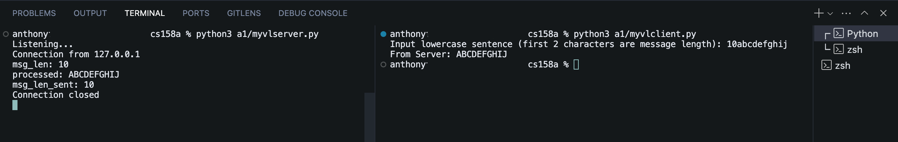

# a1

## How to Run

1. First, start the server in one terminal:

```bash
python myvlserver.py
```

2. Then, in another terminal, start the client:

```bash
python myvlclient.py
```

## Usage Example

### Terminal 1 (Server)

```bash
$ python3 a1/myvlserver.py
Listening...
Connection from 127.0.0.1
msg_len: 10
processed: ABCDEFGHIJ
msg_len_sent: 10
Connection closed
```

### Terminal 2 (Client)

```bash
$ python3 a1/myvlclient.py
Input lowercase sentence (first 2 characters are message length): 10abcdefghij
From Server: ABCDEFGHIJ
```

## Message Formatting

- The first n bytes of each message must be the length of the message
- The message length should match the actual message length
- Example: "10helloworld" where:
  - "10" is the length prefix (2 bytes)
  - "helloworld" is the actual message (10 characters)

## Notes

- The server will continue to run until manually terminated
- The client will terminate after receiving the complete response
- Messages must be between 1 and 99 characters when n = 2

## Example Inputs

- 10abcdefghij
- 80abcdefghijabcdefghijabcdefghijabcdefghijabcdefghijabcdefghijabcdefghijabcdefaaaa

## Screenshot
