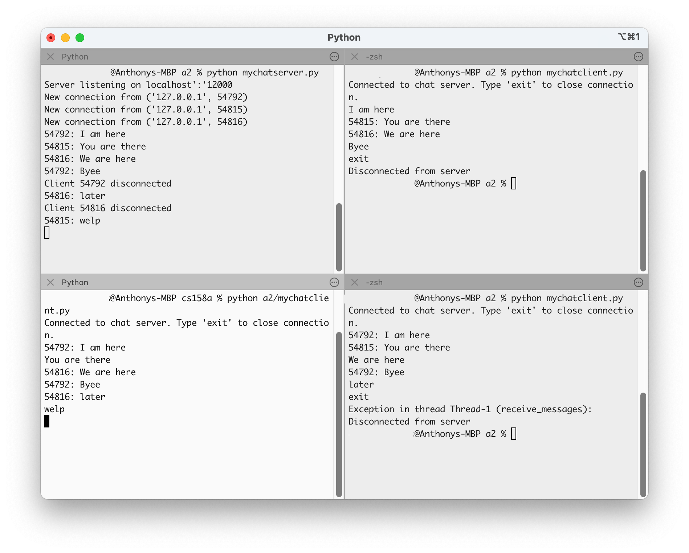

# a2 Chat

## How to Run

### 1. Start the Server

First, start the chat server in a terminal:

```bash
python mychatserver.py
```

The server will begin to listen on localhost:12000

### 2. Initiate the Clients

In separate terminal windows, run the chat client(s):

```bash
python mychatclient.py
```

Each client will connect to the server and display "Connected to chat server. Type 'exit' to close connection."

### 3. Chat

- Send messages in the chat client terminals
- Messages will be broadcast to all other connected clients
- Type 'exit' to disconnect from the server
- Multiple chat clients can connect to the server

## Execution Example
