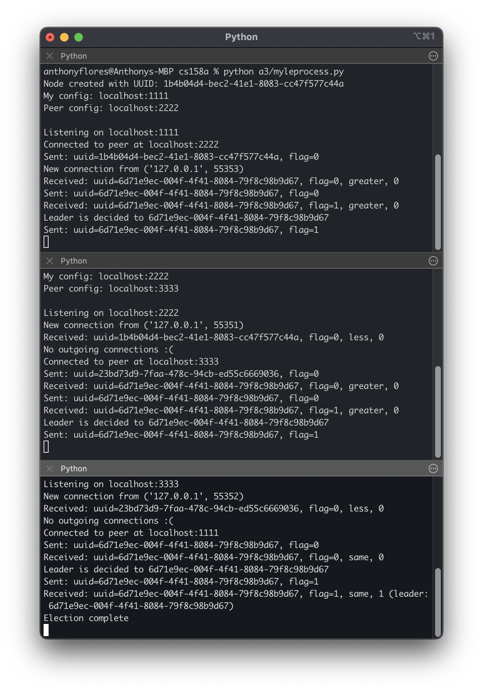
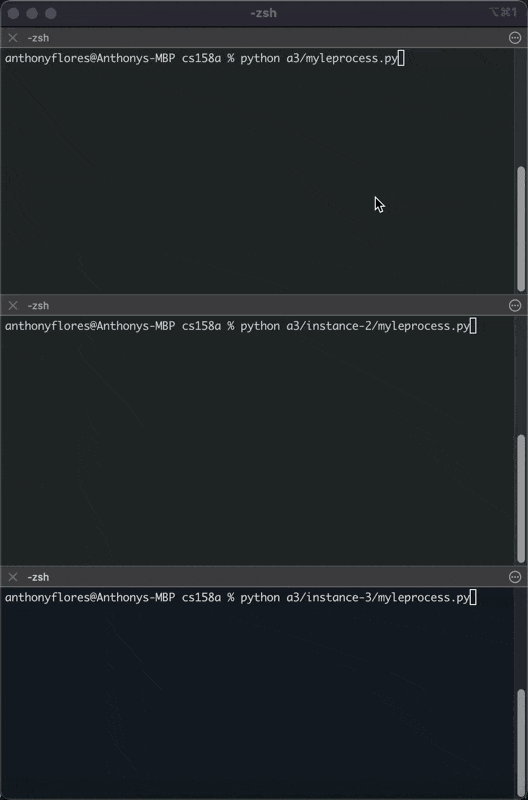

# a3

## How to Run

### Single Process

To run a process:

```bash
python myleprocess.py
```

### Demo with Three Processes

1. **Create three directories** with copies of the process:

   - `instance-1/`
   - `instance-2/`
   - `instance-3/`

2. **Configure each instance** with appropriate config.txt files:

   **instance-1/config.txt:**

   ```
   127.0.0.1,5001
   127.0.0.1,5002
   ```

   **instance-2/config.txt:**

   ```
   127.0.0.1,5002
   127.0.0.1,5003
   ```

   **instance-3/config.txt:**

   ```
   127.0.0.1,5003
   127.0.0.1,5001
   ```

3. **Run all three processes** in separate terminals:

## Execution Example

```
Node created with UUID: 2b542ffd-c00c-422b-9399-defd829b4ba8
My config: 127.0.0.1:5001
Peer config: 127.0.0.1:5002

Listening on 127.0.0.1:5001
Connected to peer at 127.0.0.1:5002
Sent: uuid=2b542ffd-c00c-422b-9399-defd829b4ba8, flag=0
New connection from ('127.0.0.1', 54967)
Received: uuid=4faf7b17-db12-4d00-8654-eeda51626c16, flag=0, greater, 0
Sent: uuid=4faf7b17-db12-4d00-8654-eeda51626c16, flag=0
Received: uuid=d4b76e1c-b437-4b10-ab29-55bd752687de, flag=0, greater, 0
Sent: uuid=d4b76e1c-b437-4b10-ab29-55bd752687de, flag=0
Received: uuid=d4b76e1c-b437-4b10-ab29-55bd752687de, flag=1, greater, 0
Leader is decided to d4b76e1c-b437-4b10-ab29-55bd752687de
Sent: uuid=d4b76e1c-b437-4b10-ab29-55bd752687de, flag=1
```


